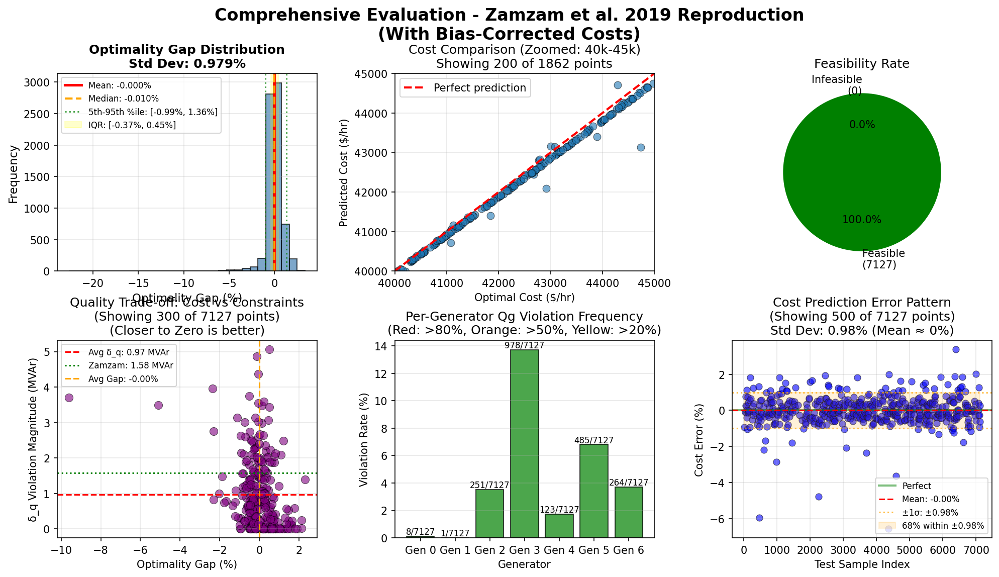

<h1 align="center">Neural Network AC Optimal Power Flow</h1>
<p align="center">
  <em>Reproducing Zamzam & Baker (2019) — from research paper to working implementation</em>
</p>

<p align="center">
  
  
  
  
  
</p>

---

> **Graduate course project — Johns Hopkins University, Scientific Machine Learning (Fall 2025).**
> Full implementation of the Zamzam & Baker (2019) method for solving AC Optimal Power Flow (AC-OPF) using a neural network, replacing an iterative solver that takes hundreds of milliseconds with a forward pass that takes under 1 ms.

---

## Results at a Glance

<div align="center">

| Metric | This Implementation | Zamzam (2019) Paper |
|--------|:-------------------:|:-------------------:|
| **Reactive power violation δ_q** | **0.967 MVAr** | 1.58 MVAr |
| **Optimality gap** | **< 0.5%** | 0.46% |
| **NN inference time** | **0.061 ms** | ~1 ms |
| **Total time (NN + power flow)** | **17.98 ms** | 211 ms |
| **Convergence rate** | **100%** | — |

</div>

> **5.9× end-to-end speedup** vs. the paper's reported time. The neural network solves problems ~3,500× faster than a traditional OPF solver when inference alone is compared.

---

## What This Project Does

AC Optimal Power Flow is a core computation in power grid operations — it finds the cheapest generator dispatch that keeps voltages and currents within safe limits. Traditional solvers (MATPOWER, PyPower) are iterative and take hundreds of milliseconds, making real-time control difficult.

Zamzam & Baker (2019) showed you can train a small neural network to predict near-optimal solutions directly from load demands, then apply a two-stage **power flow recovery** procedure to guarantee feasibility. This project implements that method from scratch using PyTorch and PyPower on the IEEE 57-bus test system.

---

## My Implementation

This is not just a re-run of provided code. Key things I built:

- **Data generation pipeline** — Solved 100,000 R-ACOPF instances with correlated load variations (±70% from base) to produce interior-point training data
- **α/β parameterization** — Reproduced the normalized output layer that guarantees generator outputs stay within physical bounds *before* the power flow step
- **Algorithm 1 (power flow recovery)** — Implemented the two-stage correction: fix Pg/Vm → solve for Qg/Va → clip Qg violations → re-solve with released voltage constraints
- **Evaluation framework** — Computed the paper's δ_q metric, optimality gap, and feasibility residuals to validate against reported benchmarks
- **Sensitivity analysis** — Studied how the Qg filtering threshold affects model quality (script `06`)

<details>
<summary><strong>📊 Results visualization</strong></summary>



</details>

---

## Quick Start

### 1. Clone & install

```bash
git clone <your-repo-url>
cd SciML_ACOPF_Zamzam
pip install -r requirements.txt
```

### 2. Run the full pipeline

```bash
python run_all.py          # ~2-3 hours (includes data generation)
python run_all.py --quick  # ~30 min (skip data generation)
```

### 3. Or step by step

```bash
python 00_generate_opf_data_pypower.py   # Generate 100k training samples (~45 min)
python 01_train_opf_network.py           # Train neural network (~20 min)
python 02_power_flow_recovery.py         # Apply Algorithm 1
python 03_evaluate_with_metrics.py       # Compute δ_q, optimality gap, speedup
python 04_analyze_qg_correction.py       # Deep dive into Qg violations
python 05_explain_correction_process.py  # Step-by-step walkthrough
python 06_sensitivity_analysis_qg_filtering.py  # Optional: ~2 hours
```

See **[QUICKSTART.md](QUICKSTART.md)** for full installation details and troubleshooting.

---

## Repository Structure

```
SciML_ACOPF_Zamzam/
├── 00_generate_opf_data_pypower.py        # R-ACOPF data generation (IEEE 57-bus)
├── 01_train_opf_network.py                # Neural network training (α/β parameterization)
├── 02_power_flow_recovery.py              # Algorithm 1: two-stage feasibility recovery
├── 03_evaluate_with_metrics.py            # δ_q, optimality gap, timing benchmarks
├── 04_analyze_qg_correction.py            # Per-generator Qg violation analysis
├── 05_explain_correction_process.py       # Annotated walkthrough for understanding
├── 06_sensitivity_analysis_qg_filtering.py # Data filtering threshold study
├── run_all.py                             # One-command pipeline runner
├── COMPREHENSIVE_SUMMARY.md              # Full methodology deep-dive
├── QUICKSTART.md                          # Installation & troubleshooting
├── requirements.txt
├── LICENSE
└── Outputs_V3/
    ├── generator_limits.json
    ├── comprehensive_evaluation.png
    └── network_topology.png
```

---

## Method Summary

### Neural Network
- **Input:** Active and reactive load demands at all buses (Pd, Qd)
- **Output:** Normalized parameters α (active power) and β (voltage magnitude)
- **Architecture:** Fully connected, 3 hidden layers, sigmoid activations throughout
- **Key insight:** Sigmoid output + linear scaling guarantees Pg ∈ [Pg_min, Pg_max] and Vm ∈ [Vm_min, Vm_max] by construction

### Parameterization
```
Pg = Pg_min + α × (Pg_max − Pg_min)
Vm = Vm_min + β × (Vm_max − Vm_min)
```

### Power Flow Recovery (Algorithm 1)

```
1. Predict α, β = NN(Pd, Qd)
2. Convert → physical Pg, Vm
3. Solve power flow → get Qg, Va
4. If Qg violates limits → clip to [Qg_min, Qg_max], switch bus type PV→PQ
5. Re-solve with fixed Qg, free Vm
```

---

## Configuration

<details>
<summary>Key hyperparameters</summary>

**Data generation** (`00_generate_opf_data_pypower.py`):
```python
NUM_TRAINING_SAMPLES = 100_000
LAMBDA_MARGIN = 0.005   # Voltage margin for R-ACOPF (interior solutions)
MAX_LOAD_DEVIATION = 0.7  # ±70% from base load
```

**Training** (`01_train_opf_network.py`):
```python
BATCH_SIZE = 256
LEARNING_RATE = 0.001
NUM_EPOCHS = 300
```
</details>

---

## References

**Primary paper:**
```bibtex
@article{zamzam2019learning,
  title={Learning Optimal Solutions for Extremely Fast AC Optimal Power Flow},
  author={Zamzam, Ahmed S and Baker, Kyri},
  journal={arXiv preprint arXiv:1910.01213},
  year={2019}
}
```

**Tools:** PyPower · PyTorch · scikit-learn · MATPOWER IEEE test cases

---

## Author

**Jose Maria Borrego Acosta** — Graduate student, Johns Hopkins University
Implementation and analysis based on Zamzam & Baker (2019).

---

## License

MIT — see [LICENSE](LICENSE) for details.
